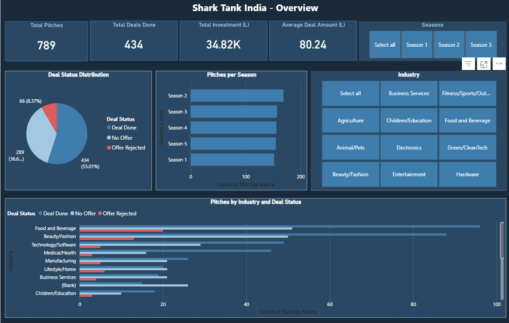
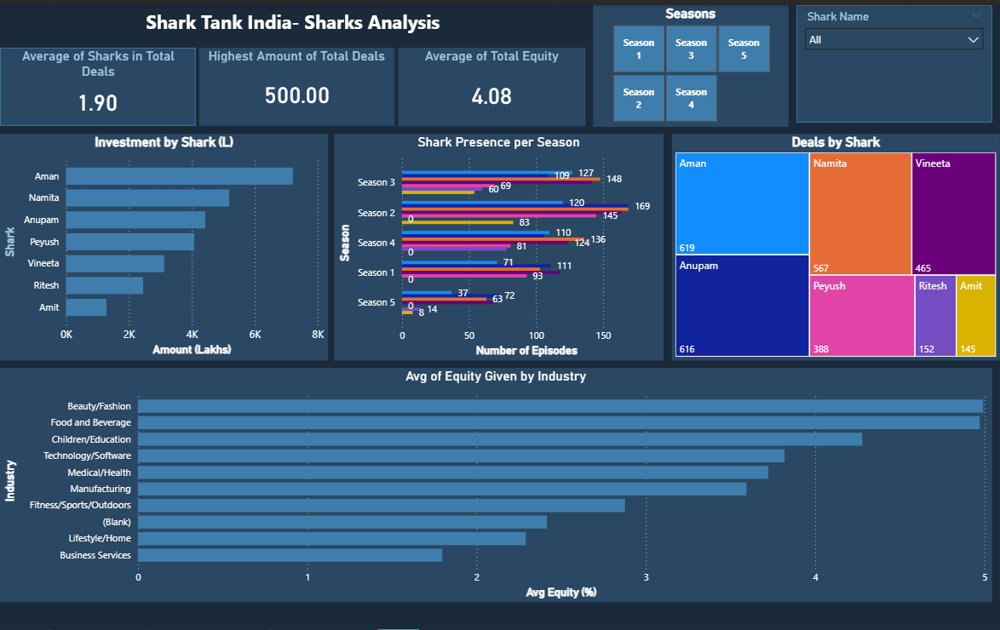
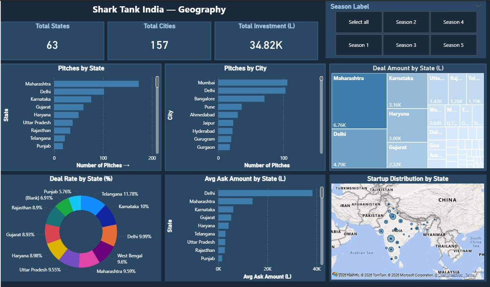

# 🦈 Shark Tank India Data Analysis

## 📌 Overview

This project is an end-to-end data analytics workflow using the Shark Tank India dataset. It includes data cleaning, exploratory data analysis, and an interactive Power BI dashboard.

---

## 📂 Project Files

* `shark_long.xlsx` → Raw dataset
* `Shark_Tank_India.xlsx` → Intermediate dataset
* `shark_tank_clean.xlsx` → Cleaned dataset
* `shark_tank_india.ipynb` → Data cleaning & EDA
* `Shark_Tank_India.pbix` → Power BI dashboard

---

## 🐍 Data Processing

* Cleaned and transformed raw data
* Handled missing values
* Fixed data types
* Created new derived columns

---

## 📊 Analysis

* Deal trends
* Industry insights
* Shark investment patterns
* Geographic distribution

---

## 📊 Dashboard

Power BI dashboard includes:

* KPIs (pitches, deals, investments)
* Shark-wise analysis
* Industry breakdown
* Location-based insights

---
## 📊 Dashboard Preview

### Overview

### Shark Analysis

### Geography

---
## 🛠️ Tools Used

* Python (Pandas, Matplotlib, Seaborn)
* Power BI
* Jupyter Notebook

---

## 🚀 How to Use

1. Run `shark_tank_india.ipynb`
2. Open `Shark_Tank_India.pbix` in Power BI

---

## ⭐ Support

If you like this project, give it a star ⭐
